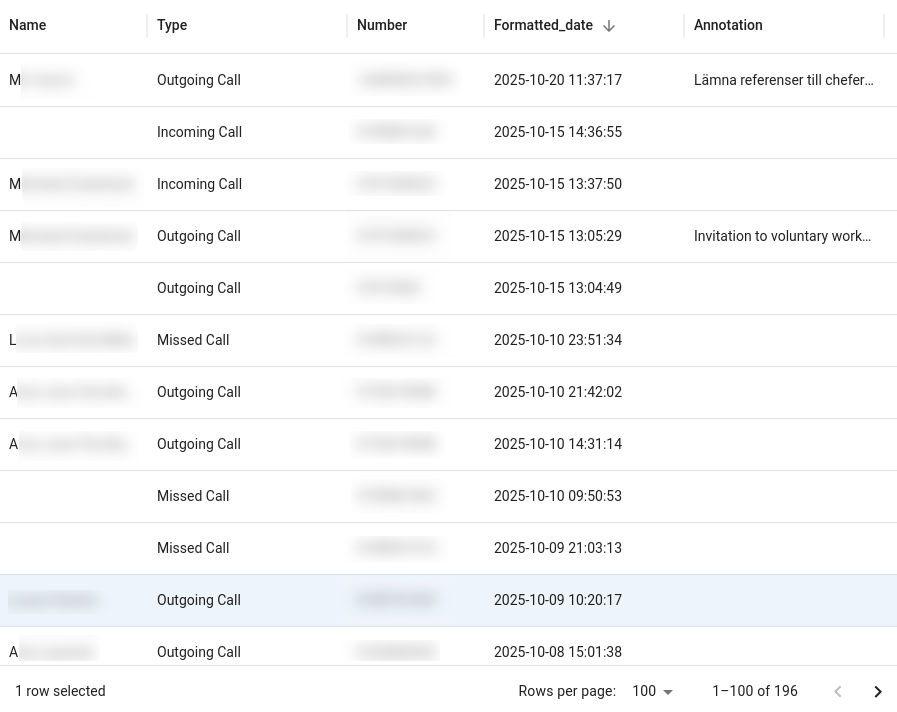

# React + Vite front-end

# Usage

After installation, go to the project directory and execute ``npm run dev`` to start the development server.

To run the application navigate to ``http://localhost:5137``. You should be able to see the table view from there.

This is part of the [TalkTrack](https://github.com/awmrozek/TalkTrack.git) project.

TalkTrack has an integrated front-end reachable both from computer and mobile devices to see calls you made for 

# Screenshots

# Features
